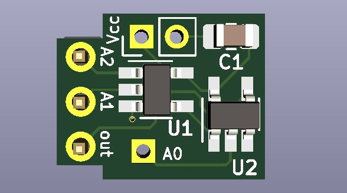
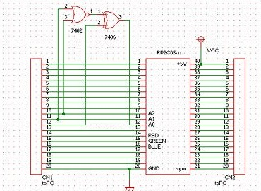

# 2c05-ppuconv
Allows 2C05 PPU chips to interface with an NES motherboard to get RGB video. 

The RC2C05 chips contain fewer glitches than the the RP2C03B chips normally used for the mod, but they have the drawback of not being directly connectable to an NES motherboard. this project solves that problem. Of course, [viletim's NESRGB kit](http://etim.net.au/nesrgb/) will give better results for an RGB mod and is generally the preferred RGB upgrade method, but this project remains of interest to those who want to mod their NES the ['old-fashioned'](nesrgbschaltung.png) way.

the logic circuit takes after the one in the schematic shown below.

refer to [nesdev wiki](https://www.nesdev.org/wiki/PPU_pinout) for the PPU pinout mentioned in the following guide.
## Install Guide:

- After removing the original 2C02 PPU and installing a DIP-40 socket in its place, cut the trace leading PPU pin 12 (CPU A0) to the motherboard. 
- Solder the assembled 2c05-ppuconv PCB to the backside of the PPU socket on the Famicom/NES motherboard. Pins A2-out of the 2c05-ppuconv correspond to pins 10-12 on the PPU socket. 
- Scrape some solder mask away from the CPU A0 trace which was cut earlier and solder a wire between there and Pad A0 on the ppuconv. 
- Connect power and ground to the ppuconv PCB. 
- Install the RC2C05 PPU in the socket. Done.

Note: trace cutting is preferred to lifting of the 2C05 PPU pin because the PPU's are a more precious commodity than NES /Famicom motherboards.
